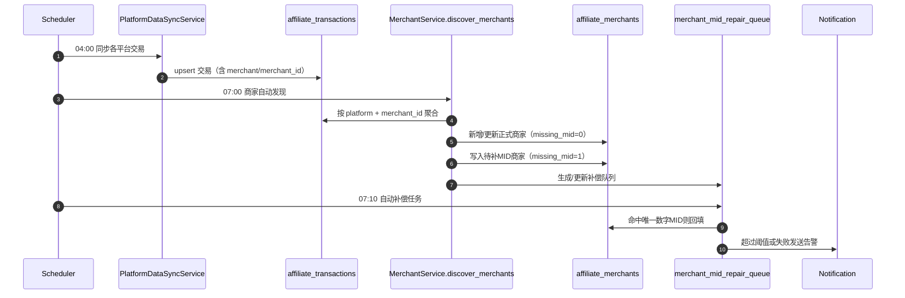
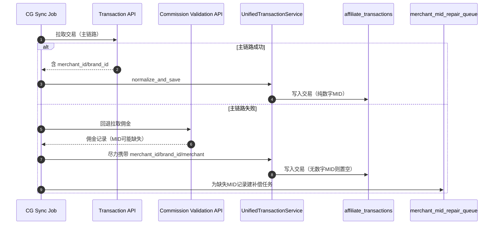
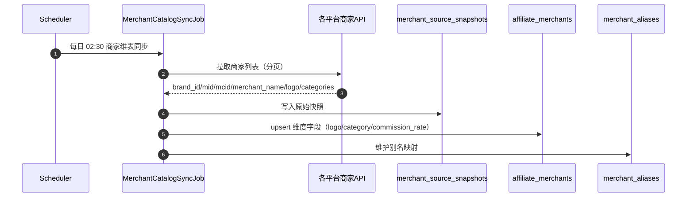
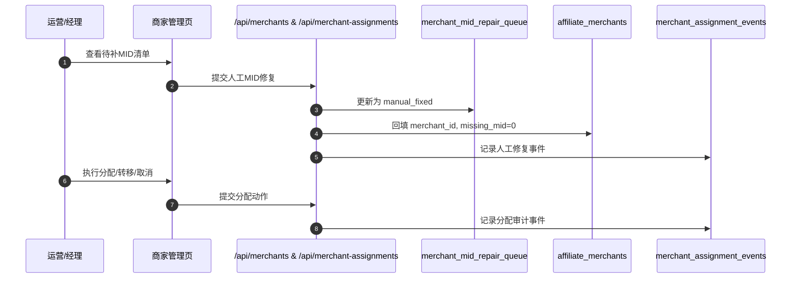

# 网站功能优化1.0

> **设计人员：** AI设计师  
> **验收人员：** 07  
> **审核状态：** ✅ OPT-001~005 终审通过 ｜ ✅ OPT-006 已上线待复核 ｜ ⏳ OPT-008 设计待审核  
> **编写日期：** 2026-02-27  
> **当前迭代：** 1.7  
> **涉及系统：** 谷歌广告数据分析平台

---

## 一、优化项总览

本次优化主线共 6 项功能（OPT-001 ~ OPT-006），补充 1 项一致性契约（OPT-007），新增 1 项紧急功能（OPT-008）：

| 编号 | 功能名称 | 变更类型 | 优先级 | 涉及端 |
|------|----------|----------|--------|--------|
| OPT-001 | 全局消息提醒系统 | 新增功能 | P0 | 前端 + 后端 |
| OPT-002 | 拒付佣金变动检测 | 新增功能 | P0 | 后端 |
| OPT-003 | 已付佣金展示 | 功能优化 | P1 | 前端 |
| OPT-004 | ROI 计算公式修改 | 功能优化 | P1 | 前端 |
| OPT-005 | MCC 数据同步双模式（API/脚本） | 新增功能 | P0 | 前端 + 后端 |
| OPT-006 | 更新日志弹窗 | 新增功能 | P1 | 前端 |
| OPT-007 | 问题反馈系统契约 | 设计补充 | P1 | 前端 + 后端 |
| OPT-008 | 广告系列暂停/启用 | 新增功能 | P0 | 前端 + 后端 |

> OPT-001 和 OPT-002 配合使用：OPT-002 负责检测拒付佣金变动并生成通知，OPT-001 负责在页面上展示通知。  
> OPT-005 为 Google Ads API 配额不足时的备用方案：通过 MCC 脚本导出数据到 Google Sheets，后端自动读取，实现零 API 配额消耗的数据同步。  
> OPT-008 为紧急运维需求：员工 MCC 被锁时无法在 Google Ads 后台暂停广告，需通过本平台远程操作广告系列状态。

### 实施状态（截至 2026-03-03）

| 编号 | 功能名称 | 状态 | 说明 |
|------|----------|------|------|
| OPT-001 | 全局消息提醒系统 | ✅ 已开发 | Header 铃铛+未读角标+下拉通知列表，后端 /api/notifications 四接口+权限，60s 轮询 |
| OPT-002 | 拒付佣金变动检测 | ✅ 已开发 | 定时任务 06:00、快照与通知写入、补跑策略、_sync_lock 互斥 |
| OPT-003 | 已付佣金展示 | ⏳ 待开发 | 设计已通过 |
| OPT-004 | ROI 计算公式修改 | ⏳ 待开发 | 设计已通过 |
| OPT-005 | MCC 双模式（API/脚本） | ✅ 已开发 | MCC 编辑页同步模式+Sheet URL，后端 sync_mode 等 5 字段+Alembic 004，公开CSV同步服务，04:00 双模式，/api/mcc/accounts/{mcc_id}/script-template|sync-sheet|test-sheet 接口 |
| OPT-006 | 更新日志弹窗 | ✅ 已上线 | 已实现：Header「更新日志」按钮 + 登录自动弹窗 + 历史版本 Collapse |
| OPT-007 | 问题反馈系统契约 | ✅ 已补齐 | 设计已补齐反馈对象、可见范围、隐私边界与回滚口径（与现网通知权限一致） |
| OPT-008 | 广告系列暂停/启用 | ⏳ 待开发 | 设计已完成，待审核通过后开发 |

---

## 二、OPT-001 全局消息提醒系统

### 2.1 功能描述

在网站顶部 Header 右侧、用户头像左边，新增铃铛图标消息提醒入口。该组件为**全局组件**，所有页面均可见（不仅限于数据中心页面）。点击铃铛展开下拉通知列表，支持已读/未读标记。

### 2.2 UI 位置示意

```
┌─────────────────────────────────────────────────────────────┐
│  谷歌广告数据分析平台              [🔔 3]  👤 wj07  员工    │
│                                     ↑                       │
│                              铃铛+红点角标                   │
└─────────────────────────────────────────────────────────────┘
```

- 位置：Header 右侧，用户头像 **左边**
- 组件：Ant Design `BellOutlined` 图标 + `Badge` 红色数字角标
- 点击行为：弹出 `Popover` 下拉面板（宽度约 360px）

### 2.3 下拉面板内容

```
┌──────────────────────────────────┐
│  消息通知                 全部已读 │
├──────────────────────────────────┤
│ 🔴 上月拒付佣金变动               │
│    1月拒付佣金从 $100 增至 $115   │
│    2026-02-04 06:00              │
├──────────────────────────────────┤
│ 🔴 本月拒付佣金异常               │
│    本月拒付佣金日增 $120 > $100   │
│    2026-02-27 06:00              │
├──────────────────────────────────┤
│ ⚪ 上月拒付佣金变动（已读）        │
│    1月拒付佣金从 $100 增至 $110   │
│    2026-02-02 06:00              │
├──────────────────────────────────┤
│          查看更多 ↓               │
└──────────────────────────────────┘
```

- 🔴 = 未读，⚪ = 已读
- 点击单条通知 → 标记为已读
- 「全部已读」按钮 → 批量标记
- 下拉面板默认展示最近 20 条，底部「查看更多」支持滚动加载

### 2.4 数据权限

> 🔧 **审核修正（S-04）：** 补充 leader 角色权限，与实际 `user.py` 中的 4 种角色对齐。  
> 🔧 **第八轮一致性修正（S-01）：** `team_id` 强制非空属于“目标约束”，当前代码尚未完全落地；本节按现网行为 + 目标落地两段式描述。

| 角色 | 枚举值 | 可见范围 |
|------|--------|----------|
| 经理 | manager | 所有用户的通知 |
| 组长 | leader | 本组成员的通知（通过 `team_id` 关联查询） |
| 组员 | member | 仅自己的通知 |
| 员工 | employee（兼容旧数据） | 仅自己的通知 |

**team_id 分组约束（目标约束，分阶段落地）：**

> 🔧 **审核修正（S-05 + 第八轮 S-01）：** 直接改 `NOT NULL` 会导致 SQLite 迁移复杂度升高，且现有数据可能存在 `team_id = NULL`。因此先统一口径为“现网兼容 + 后续强制”。

**第一阶段（现网口径，已实现）：**

- 后端现状：`team_management.py` 中 `UserCreate.team_id` 仍为 `Optional[int]`（与现网一致）
- 数据库现状：`users.team_id` 仍为 `nullable=True`
- 权限兜底：通知查询对 leader 增加 `team_id` 为空保护（`team_id IS NOT NULL` 语义）
- 验收口径：当前版本按“可空但受控”验收，不再声明“已改为必填”

**第二阶段（目标约束，待实施）：**

- 应用层：将 `UserCreate.team_id` 改为必填；`UserUpdate.team_id` 禁止显式写入 `NULL`
- 数据修复：Alembic 数据迁移将历史 `team_id = NULL` 用户分配到默认分组
- 数据库层：确认无 NULL 后，通过重建表将 `users.team_id` 改为 `NOT NULL`

**回滚方案：** 第二阶段若出现风险，先回滚应用层必填校验；数据库约束改造必须在维护窗口执行并可单独回滚。

**影响范围：**
- leader 角色通知可见范围依赖 `team_id`
- 历史空分组用户在第一阶段不会被 leader 横向看到，避免权限漂移

API 查询逻辑：
- `manager`：不加 `user_id` 过滤，返回全部通知
- `leader`：查询 `user_id IN (SELECT id FROM users WHERE team_id = 当前用户.team_id)`
- `member` / `employee`：`WHERE user_id = 当前用户.id`

### 2.5 数据刷新策略

- 页面首次加载时获取未读数量
- 之后每 60 秒轮询一次 `/api/notifications/unread-count`
- 点击铃铛时实时拉取通知列表

### 2.6 新增数据库表

**表名：`notifications`**

| 字段 | 类型 | 说明 |
|------|------|------|
| id | INTEGER PK | 主键 |
| user_id | INTEGER FK → users.id | 通知归属用户 |
| type | VARCHAR(50) | 通知类型：`rejected_monthly` / `rejected_daily` / `system_announcement` / `sync_error`（预留扩展） |
| title | VARCHAR(200) | 通知标题 |
| content | TEXT | 通知详细内容 |
| is_read | BOOLEAN DEFAULT FALSE | 是否已读 |
| created_at | DATETIME | 创建时间 |

> 🔧 **审核修正（L-03）：** 补充索引定义。

**索引：**

```python
Index("idx_notification_user_created", "user_id", "created_at")
Index("idx_notification_user_read", "user_id", "is_read")
```

新建文件：`backend/app/models/notification.py`

> 🔧 **审核修正（L-02）：** 增加通知过期清理策略。

**通知清理策略：**
- 在定时任务中增加清理逻辑：每月 1 号自动删除 90 天前的已读通知
- 清理 SQL：`DELETE FROM notifications WHERE is_read = TRUE AND created_at < datetime('now', '-90 days')`
- **未读通知保护：** 超过 180 天的未读通知自动标记为已读（防止长期不登录用户的通知无限累积）
- 清理 SQL：`UPDATE notifications SET is_read = TRUE WHERE is_read = FALSE AND created_at < datetime('now', '-180 days')`
- 可在后续版本实现，不阻塞本次上线

### 2.7 数据库迁移方案

> 🔧 **审核修正（S-02）：** 补充数据库迁移方案，避免部署后 `no such table` 错误。  
> 🔧 **审核修正（S-07）：** 统一使用 Alembic 迁移，不再使用 `create_all()`，避免与 OPT-005 的 Alembic 策略冲突。

**采用 Alembic 统一迁移（迭代 1.3 修正）：**

项目已有 Alembic 基础设施（`backend/alembic/` 目录，含 2 个历史迁移版本 001、002），所有数据库变更统一走 Alembic。

**迁移脚本内容（版本 003）：**

```bash
alembic revision --autogenerate -m "add_notifications_and_commission_snapshots"
```

该迁移将创建 `notifications` 和 `commission_snapshots` 两张新表。

**部署步骤：**

```bash
cd backend
alembic upgrade head
```

**回滚命令：**

```bash
alembic downgrade -1
```

> 不再在 `startup_event()` 中使用 `Base.metadata.create_all()`，避免与 Alembic 的 `autogenerate` 检测冲突。

修改文件：`backend/app/main.py` — 仅注册新路由，不添加 `create_all()` 逻辑。

### 2.8 新增 API 接口

新建文件：`backend/app/api/notifications.py`

> 🔧 **审核修正（M-01）：** 通知列表接口增加分页参数。

| 方法 | 路径 | 参数 | 说明 |
|------|------|------|------|
| GET | `/api/notifications` | `page`（默认1）、`page_size`（默认20） | 获取通知列表（分页，按角色权限过滤） |
| GET | `/api/notifications/unread-count` | - | 获取未读数量（铃铛角标数字） |
| PUT | `/api/notifications/{id}/read` | - | 标记单条为已读 |
| PUT | `/api/notifications/read-all` | - | 全部标记已读 |

**API 权限校验规则（迭代 1.3 新增，修正 M-06）：**

| 接口 | 权限校验 |
|------|----------|
| `GET /api/notifications` | 按角色过滤（2.4 节逻辑），只返回当前用户有权查看的通知 |
| `GET /api/notifications/unread-count` | 同上，只统计当前用户有权查看的未读通知 |
| `PUT /api/notifications/{id}/read` | 校验该通知是否属于当前用户可见范围（防止越权标记他人通知）；不在可见范围内返回 `403 Forbidden` |
| `PUT /api/notifications/read-all` | 只标记当前用户**有权查看**的通知为已读（manager 标记全部，leader 标记本组，member/employee 标记自己的） |

权限过滤统一在 SQL 层实现（通过 `WHERE` 条件），不在应用层做二次过滤，确保性能和一致性。

**分页响应格式：**

```json
{
  "items": [...],
  "total": 120,
  "page": 1,
  "page_size": 20,
  "total_pages": 6
}
```

在 `backend/app/main.py` 中注册新路由。

### 2.9 前端修改

修改文件：`frontend/src/components/Layout/index.jsx`

在 Header 右侧区域，`<Dropdown>` 用户头像下拉菜单组件之前，插入铃铛通知组件。

---

## 三、OPT-002 拒付佣金变动检测

### 3.1 功能描述

通过后端定时任务，每天自动检测每个用户的拒付佣金是否发生变动。有变动时自动生成通知，写入 `notifications` 表，由 OPT-001 的消息提醒系统展示给用户。

### 3.2 检测规则

**规则A — 本月日变动提醒（type: `rejected_daily`）**

| 项目 | 说明 |
|------|------|
| 对比对象 | 本月拒付佣金「昨天累计值」 vs 「今天累计值」 |
| 触发条件 | 差额 > 阈值（默认 100 USD，可配置） |
| 示例 | 昨天本月拒付佣金累计 $500，今天变为 $620，差额 $120 > $100 → 触发提醒 |
| 通知标题 | "本月拒付佣金异常" |
| 通知内容 | "本月拒付佣金日增 $120（从 $500 增至 $620），超过 $100 阈值" |

> 🔧 **审核修正（M-03）：** 阈值配置化，不再硬编码。

**阈值配置：** 在 `backend/app/config.py` 中新增配置项：

```python
# 拒付佣金日变动检测阈值（USD）
REJECTED_COMMISSION_DAILY_THRESHOLD: float = 100.0
```

**规则B — 上月变动提醒（type: `rejected_monthly`）**

| 项目 | 说明 |
|------|------|
| 对比对象 | 上月拒付佣金「当前总额」 vs 「上次快照总额」 |
| 触发条件 | 金额有任何变化（不论增减） |
| 不触发条件 | 金额与上次快照相同 → 不操作 |
| 示例 | 2/1 检测到1月拒付 $100 → 记录快照；2/2 变为 $110 → 提醒+更新快照；2/3 仍为 $110 → 不提醒；2/4 变为 $115 → 提醒+更新快照 |
| 通知标题 | "上月拒付佣金变动" |
| 通知内容 | "1月拒付佣金从 $100 增至 $115（变动 +$15）" |

### 3.3 数据查询定义

> 🔧 **审核修正（S-03）：** 明确数据查询的日期字段、范围、NULL 处理和精度。

| 项目 | 定义 |
|------|------|
| 日期筛选字段 | `transaction_time`（与前端展示一致，非 `created_at`） |
| 本月日期范围 | 本月1号 `00:00:00` 至 昨天 `23:59:59`（06:30 执行时今天数据可能未同步完，排除今天） |
| 上月日期范围 | 上月1号 `00:00:00` 至 上月最后一天 `23:59:59` |
| 状态筛选 | `status = 'rejected'` |
| 聚合维度 | 按 `user_id` 聚合 |
| `user_id` 为 NULL 处理 | 通过 `affiliate_account_id` 关联 `affiliate_accounts` 表反查 `user_id`；若仍无法关联，归入「未分配」汇总，生成一条通知发送给 manager 角色用户 |
| 金额字段 | `commission_amount`（`Numeric(12,2)` 类型） |

### 3.4 快照数据库表

**表名：`commission_snapshots`**

> 🔧 **审核修正（M-04）：** `snapshot_type` 命名改为更精确的 `current_month` / `previous_month`。  
> 🔧 **审核修正（S-03）：** `total_rejected` 类型改为 `Numeric(12,2)`，与交易表精度一致。

| 字段 | 类型 | 说明 |
|------|------|------|
| id | INTEGER PK | 主键 |
| user_id | INTEGER FK → users.id | 用户 |
| snapshot_type | VARCHAR(20) | 类型：`current_month`（本月累计快照）/ `previous_month`（上月总额快照） |
| period | VARCHAR(20) | 期间标识，如 `"2026-01"`（代表1月份） |
| total_rejected | Numeric(12,2) | 该期间拒付佣金总额 |
| checked_at | DATETIME | 检测时间 |
| created_at | DATETIME | 创建时间 |

新建文件：`backend/app/models/commission_snapshot.py`

> 🔧 **审核修正（L-07）：** 补充唯一约束，防止重复快照记录。

**唯一约束：**

```python
UniqueConstraint("user_id", "snapshot_type", "period", name="uq_commission_snapshot_user_type_period")
```

### 3.5 定时任务配置

> 🔧 **审核修正（S-01/S-06）：** 时间口径最终统一为：backfill 05:00，拒付佣金检测 06:00，补跑 06:30/07:00/07:30。

修改文件：`backend/app/services/scheduler.py`

- 新增函数：`check_rejected_commission_job()`
- 在 `start_scheduler()` 中注册，执行时间：每天北京时间 **06:00**
- 选择 06:00 的原因：backfill 任务在 05:00 执行，通常耗时 10-20 分钟，06:00 具备 60 分钟缓冲窗口
- **前置检查：** 执行前检测 backfill 任务是否仍在运行，若仍在运行则跳过并触发补跑

**补跑策略（迭代 1.2 新增）：**

> 🔧 **迭代 1.2 确认：** 06:00 检测若因 backfill 未完成而跳过，最多补跑 3 次，仍失败则放弃。

- 06:00 首次执行：检测 backfill 是否仍在运行
  - 若 backfill 已完成 → 正常执行检测
  - 若 backfill 仍在运行 → 跳过，记录日志，触发补跑调度
- 补跑时间：**06:30 → 07:00 → 07:30**（间隔 30 分钟，最多 3 次）
- 每次补跑前仍检测 backfill 状态
- 3 次补跑均失败 → 放弃本日检测，记录 `WARNING` 级别日志：`"拒付佣金检测：连续 3 次补跑均因 backfill 未完成而跳过，放弃本日检测"`
- 实现方式：使用 APScheduler `add_job()` 动态添加一次性补跑任务（`trigger='date'`）
- **互斥锁保护：** 拒付佣金检测任务纳入全局 `_sync_lock` 保护范围，避免与 backfill 同时写入 SQLite 导致 `database is locked`

### 3.6 检测流程

> 🔧 **审核修正（M-05）：** 快照更新和通知写入必须在同一个数据库事务中完成。

```
check_rejected_commission_job() 执行流程：

0. 前置检查：若 backfill 任务仍在运行 → 记录日志，跳过本次检测
1. 获取所有活跃用户列表
2. 遍历每个用户：
   │
   ├─ 规则A：本月日变动检测
   │   ├─ 查询本月拒付佣金总额
   │   │   └─ SQL: SELECT SUM(commission_amount) FROM affiliate_transactions
   │   │          WHERE user_id = ? AND status = 'rejected'
   │   │          AND transaction_time BETWEEN 本月1号00:00:00 AND 昨天23:59:59
   │   │   └─ user_id 为 NULL 时：JOIN affiliate_accounts 反查 user_id
   │   ├─ 从 commission_snapshots 取 snapshot_type='current_month'、period=本月 的最近一条
   │   ├─ 计算差额 = 当前总额 - 快照总额
   │   ├─ 差额 > 阈值（config.REJECTED_COMMISSION_DAILY_THRESHOLD）：
   │   │   └─ 在同一事务中：生成通知 + 更新快照
   │   └─ 差额 <= 阈值：仅更新快照（不生成通知）
   │
   └─ 规则B：上月变动检测
       ├─ 查询上月拒付佣金总额
       │   └─ SQL: 同上，日期范围改为上月1号~上月最后一天
       ├─ 从 commission_snapshots 取 snapshot_type='previous_month'、period=上月 的最近一条
       ├─ 当前总额 != 快照总额：
       │   └─ 在同一事务中：生成通知 + 插入新快照
       └─ 当前总额 == 快照总额 → 不操作
```

**事务保护示例：**

```python
with db.begin():
    # 写入通知
    db.add(notification)
    # 更新/插入快照
    db.add(snapshot)
# 事务自动提交，任一失败自动回滚
```

### 3.7 更新后的定时任务时间线

> 🔧 **审核修正（S-01/S-06）：** 时间线与代码对齐：拒付佣金主任务 06:00，补跑窗口 06:30→07:00→07:30。

| 时间（北京） | 任务 | 状态 |
|-------------|------|------|
| 03:00 | 数据库自动备份 | 已有 |
| 04:00 | 每日同步（Google Ads + 平台数据 + 分析 + L7D） | 已有 |
| 05:00 | Backfill 历史数据补齐 | 已有 |
| **06:00** | **拒付佣金变动检测**（含前置检查 + 补跑策略） | **新增** |
| 16:00 | 平台数据补充同步 | 已有 |
| 每月1/15号 00:00 | 已付佣金同步 | 已有 |

---

## 四、OPT-003 已付佣金展示

### 4.1 功能描述

在数据中心页面的「平台数据」tab 中，新增已付佣金（approved 状态的佣金）的展示。包括统计卡片和表格列，汇总模式和明细模式均展示。

### 4.2 修改文件

`frontend/src/pages/DataCenter.jsx`

### 4.3 统计卡片区域变更

当前卡片顺序（6个）：

```
总佣金 | 拒付佣金 | 净佣金 | 总订单 | ROI | 视图切换
```

修改后卡片顺序（7个）：

```
总佣金 | 已付佣金✨ | 拒付佣金 | 净佣金 | 总订单 | ROI | 视图切换
```

已付佣金卡片样式：
- 标题：`已付佣金`
- 前缀：`$`
- 精度：2位小数
- 颜色：绿色（`#52c41a`）

### 4.4 汇总模式表格变更

在 `platformSummaryColumns` 中，「总佣金($)」列之后添加「已付佣金($)」列：

| 属性 | 值 |
|------|------|
| title | 已付佣金($) |
| dataIndex | approved_commission |
| width | 110 |
| sorter | 支持排序 |
| render | 绿色字体，$前缀，2位小数 |

数据来源：后端 `/api/platform-data/summary` 接口的 `merchant_breakdown` 中已返回 `approved_commission` 字段（经审核验证，`platform_data.py` 第 539 行），**无需后端改动**。

> 🔧 **审核修正（M-08）：** 明确「净佣金」定义不变。

**净佣金定义说明：** 净佣金 = 总佣金 - 拒付佣金（维持现有计算逻辑不变）。已付佣金作为独立展示列，不参与净佣金计算。原因：已付佣金和拒付佣金不一定覆盖全部佣金（可能存在 pending 状态），净佣金的现有定义更准确。

### 4.5 明细模式表格变更

> 🔧 **审核修正（L-04）：** 明确明细模式下「已付佣金」列的 render 逻辑。

在 `platformDetailColumns` 中添加「已付佣金($)」列。

**render 逻辑：**

```javascript
render: (value, record) => record.status === 'approved' 
  ? <span style={{ color: '#52c41a' }}>${record.commission_amount.toFixed(2)}</span>
  : <span style={{ color: '#999' }}>$0.00</span>
```

- `status === 'approved'` → 显示绿色金额
- 其他状态 → 显示灰色 `$0.00`

### 4.6 统计计算变更

在 `platformStats` 计算逻辑中新增 `totalApproved`：

- 汇总模式：`totalApproved = sum(item.approved_commission)`
- 明细模式：`totalApproved = sum(item.commission_amount where status === 'approved')`

---

## 五、OPT-004 ROI 计算公式修改

### 5.1 功能描述

将 ROI 计算公式从「佣金 ÷ 费用」改为「(佣金 - 费用) ÷ 费用」，结果显示为小数。

### 5.2 修改文件

`frontend/src/pages/DataCenter.jsx`（第590~797行）

### 5.3 公式变更

> 🔧 **审核修正（L-01）：** 明确 ROI 保留 2 位小数。

| 项目 | 修改前 | 修改后 |
|------|--------|--------|
| 公式 | 佣金 / 费用 | (佣金 - 费用) / 费用 |
| 示例 | 佣金=$176, 费用=$100 → ROI=1.76 | 佣金=$176, 费用=$100 → ROI=0.76 |
| 显示格式 | 小数（如 1.76） | 小数，保留 2 位（如 0.76） |
| 卡片标题 | "ROI (佣金/费用)" | "ROI" |

**费用为 0 时的处理（迭代 1.2 新增）：**

> 🔧 **迭代 1.2 确认：** 费用为 0 时 ROI 显示「-」，不参与排序。

| 场景 | 处理方式 |
|------|----------|
| 费用 = 0 | ROI 显示 `-`（灰色），排序时视为 `null`，排在最后 |
| 费用 > 0 | 正常计算 `(佣金 - 费用) / 费用`，保留 2 位小数 |

```javascript
// ROI 计算逻辑
const roi = cost === 0 ? null : ((commission - cost) / cost);

// 显示逻辑
render: (value) => value === null 
  ? <span style={{ color: '#999' }}>-</span>
  : <span style={{ color: value >= 0 ? '#3f8600' : '#cf1322' }}>{value.toFixed(2)}</span>

// 排序逻辑
sorter: (a, b) => {
  if (a.roi === null && b.roi === null) return 0;
  if (a.roi === null) return 1;  // null 排最后
  if (b.roi === null) return -1;
  return a.roi - b.roi;
}
```

> 🔧 **审核修正（B-05）：** 在 ROI 卡片增加 Tooltip 说明公式变更。

**ROI 卡片 Tooltip：** 鼠标悬停时显示 `"ROI = (佣金 - 费用) ÷ 费用"`，帮助用户理解新公式。

### 5.4 颜色规则变更

> 🔧 **审核修正（M-09）：** 统一颜色值，沿用现有代码的 `#3f8600`（深绿）和 `#cf1322`（深红），与 OPT-003 的 `#52c41a`（亮绿）区分开，避免视觉混淆。

| 条件 | 修改前 | 修改后 |
|------|--------|--------|
| 盈利 | ROI >= 1 → 绿色（`#3f8600`） | ROI >= 0 → 绿色（`#3f8600`） |
| 亏损 | ROI < 1 → 红色（`#cf1322`） | ROI < 0 → 红色（`#cf1322`） |
| 费用为0 | 无 | 灰色（`#999`） |

**颜色使用规范：**

| 场景 | 颜色 | 色值 |
|------|------|------|
| ROI 盈利 | 深绿 | `#3f8600` |
| ROI 亏损 | 深红 | `#cf1322` |
| 已付佣金 | 亮绿 | `#52c41a` |
| 费用为0/无数据 | 灰色 | `#999999` |

---

## 六、OPT-005 MCC 数据同步双模式（API/脚本）

> 🔧 **迭代 1.2 新增功能**

### 6.1 功能描述

为 Google Ads 数据同步提供双模式支持：当 API 配额（Explorer Access）不足时，可将指定 MCC 切换为「脚本模式」，通过 Google Ads MCC 脚本将数据导出到 Google Sheets，后端定时读取 Sheets 数据入库，实现零 API 配额消耗的数据同步。

### 6.2 核心概念

| 概念 | 说明 |
|------|------|
| API 模式（默认） | 现有方式，后端直接调用 Google Ads API 拉取数据 |
| 脚本模式 | MCC 脚本导出数据到 Google Sheets → 后端读取 Sheets → 数据入库 |
| sync_mode | MCC 级别的同步模式字段，值为 `api`（默认）或 `script` |
| 切换粒度 | 每个 MCC 独立控制，可混合使用两种模式 |

### 6.3 数据库变更

**修改表：`google_mcc_accounts`**

新增 5 个字段：

| 字段 | 类型 | 默认值 | 说明 |
|------|------|--------|------|
| sync_mode | VARCHAR(10) | `'api'` | 同步模式：`api` / `script` |
| google_sheet_url | VARCHAR(500) | NULL | Google Sheets URL（脚本模式必填） |
| sheet_sync_hour | INTEGER | 4 | Sheet 读取时间-小时（0-23） |
| sheet_sync_minute | INTEGER | 0 | Sheet 读取时间-分钟（0-59） |
| last_sheet_sync_at | DATETIME | NULL | 最近一次 Sheet 同步完成时间（用于判断首次/日常同步） |

> 🔧 **迭代 1.2 确认：** 使用 Alembic 迁移版本管理新增字段，不使用手动 SQL 脚本。

**数据库迁移方式：Alembic**

- 初始化 Alembic（若项目尚未使用）：`alembic init alembic`
- 生成迁移脚本：`alembic revision --autogenerate -m "add_mcc_sync_mode_fields"`
- 迁移内容：`ALTER TABLE google_mcc_accounts ADD COLUMN sync_mode VARCHAR(10) DEFAULT 'api'` 等 5 条
- 执行迁移：`alembic upgrade head`
- 回滚命令：`alembic downgrade -1`

### 6.4 同步调度方案

> 🔧 **迭代 1.2 确认：** Ads 脚本 02:00 前写完 Sheet，后端 04:00 统一读取（API + Sheet 同一轮）。

**调度流程：**

```
02:00 前  MCC 脚本在 Google Ads 中执行，将数据写入 Google Sheets
          ↓
04:00     daily_auto_sync_and_analysis_job() 启动
          ├─ 遍历所有 MCC
          │   ├─ sync_mode = 'api'  → 调用 Google Ads API 同步（现有逻辑）
          │   └─ sync_mode = 'script' → 调用 GoogleSheetSyncService 读取 Sheets
          ├─ 平台数据同步
          ├─ 数据分析
          └─ L7D 计算
```

- API 模式和脚本模式在 04:00 同一轮内顺序执行
- 脚本模式的 `sheet_sync_hour` / `sheet_sync_minute` 字段保留但不用于独立调度，仅作为配置记录
- **保留原因（L-09）：** 未来若需要支持各 MCC 独立调度读取时间（如某些 MCC 的 Ads 脚本在不同时间完成），可直接启用这两个字段，无需再做数据库迁移
- 若 Sheets 数据为空或读取失败，记录 `ERROR` 日志并跳过该 MCC，不影响其他 MCC

### 6.5 Google Sheets 数据格式

**Sheet 名称：** `DailyData`（固定）

**列定义：**

> 🔧 **审核修正（S-08）：** 增加 `CampaignId` 列，与现有表唯一约束 `(mcc_id, campaign_id, date)` 对齐。

| 列名 | 对应字段 | 说明 |
|------|----------|------|
| Date | date | 日期，格式 YYYY-MM-DD |
| Account | customer_id | 广告账户 ID |
| AccountName | account_name | 账户名称 |
| CampaignId | campaign_id | 广告系列 ID（数字） |
| CampaignName | campaign_name | 广告系列名称 |
| Impressions | impressions | 展示次数 |
| Clicks | clicks | 点击次数 |
| Cost | cost_micros | 费用（微单位，需 ÷ 1000000） |
| Conversions | conversions | 转化次数 |
| ConversionValue | conversions_value | 转化价值 |
| Currency | currency_code | 货币代码 |

### 6.6 GoogleSheetSyncService

**新建文件：** `backend/app/services/google_sheet_sync.py`

**核心方法：**

```python
class GoogleSheetSyncService:
    def __init__(self, db: Session):
        self.db = db

    def sync_mcc_from_sheet(
        self,
        mcc: GoogleMccAccount,
        force_refresh: bool = False,   # 兼容参数：手动触发时固定 True
        force_full_sync: bool = False  # 实际控制项：是否强制按“首次范围”全量同步
    ) -> dict:
        """从公开 CSV 读取数据并写入 google_ads_api_data 表"""
        # 1. 解析 spreadsheet_id（无需服务账号）
        # 2. HTTP GET 公开 CSV（重试退避）
        # 3. 判断首次/日常同步，确定日期范围
        # 4. 数据清洗：类型转换、cost_micros 转换、去重
        # 5. 调用 CampaignMatcher 提取 platform_code / account_code
        # 6. UPSERT 到 google_ads_api_data 表
        # 7. 返回统计：{inserted: N, updated: N, skipped: N}

    def test_sheet_connection(self, sheet_url: str) -> dict:
        """测试 Sheet 连接，返回行数、最新日期、列名"""
        # 返回: {row_count, last_date, sample_columns, status}
```

**首次同步策略（迭代 1.3 新增，修正 RS-02）：**

> 🔧 **审核修正（RS-02）：** 补充首次同步与日常同步的区分策略，解决 MCC 切换到脚本模式后本月数据修复问题。

MCC 从 API 模式切换到脚本模式后，首次同步需要覆盖本月全部数据，修复因 API 配额不足导致的数据缺失/不完整。

**首次同步判断条件：**

```python
def _is_first_sheet_sync(self, mcc: GoogleMccAccount) -> bool:
    """判断该 MCC 是否为首次 Sheet 同步"""
    # 检查 google_ads_api_data 表中是否存在该 MCC 的 Sheet 来源记录
    # 方式：检查 last_sheet_sync_at 字段（新增字段，见下方说明）
    return mcc.last_sheet_sync_at is None
```

**新增字段：** `google_mcc_accounts` 表增加 `last_sheet_sync_at`（DATETIME, nullable=True, 默认 NULL），记录最近一次 Sheet 同步完成时间。首次同步完成后写入时间戳，后续同步据此判断。

> 该字段纳入 Alembic 迁移版本 004（与 sync_mode 等 4 字段一起），总计 5 个新增字段。

**首次同步 vs 日常同步对比：**

| 项目 | 首次同步 | 日常同步 |
|------|----------|----------|
| 触发条件 | `last_sheet_sync_at IS NULL` 或 `force_full_sync=True` | `last_sheet_sync_at IS NOT NULL` 且 `force_full_sync=False` |
| 日期范围 | 本月1号 至 昨天 | 昨天 1 天 |
| force_refresh | 手动接口固定为 `True`（兼容参数） | 调度任务默认 `False` |
| force_full_sync | `True` 时强制按首次范围 | 默认 `False` |
| 原数据处理 | UPSERT 覆盖更新（不删除、不跳过） | UPSERT 覆盖更新 |
| 数据相同时 | 仍执行更新，刷新 `last_sync_at` | 仍执行更新 |
| 完成后操作 | 更新 `mcc.last_sheet_sync_at = now()` | 更新 `mcc.last_sheet_sync_at = now()` |

**首次同步流程：**

```
sync_mcc_from_sheet(mcc) 执行流程：

1. 判断是否首次同步：mcc.last_sheet_sync_at IS NULL？
   │
   ├─ 首次同步（last_sheet_sync_at = NULL）：
   │   ├─ 日期范围 = 本月1号 ~ 昨天
   │   ├─ force_refresh = True（绕过增量检查）
   │   ├─ 读取 Sheet 全部数据，按日期范围过滤
   │   ├─ UPSERT 到 google_ads_api_data（覆盖更新，不删除、不跳过）
   │   ├─ 更新 mcc.last_sheet_sync_at = now()
   │   └─ 日志：INFO "MCC {name} 首次 Sheet 同步完成，覆盖 {start}~{end}，{N} 条记录"
   │
   └─ 日常同步（last_sheet_sync_at != NULL）：
       ├─ 日期范围 = 昨天 1 天（与 API 模式一致）
       ├─ force_refresh = False（正常增量检查）
       ├─ 读取 Sheet 全部数据，按昨天日期过滤
       ├─ UPSERT 到 google_ads_api_data
       ├─ 更新 mcc.last_sheet_sync_at = now()
       └─ 缺失数据由 05:00 backfill 兜底
```

**蝴蝶效应防护：**

首次同步覆盖本月全部数据后，以下功能的数据准确性得到保障：
- 数据中心页面：费用/ROI 统计基于完整的本月数据
- L7D 分析：最近 7 天分析结果准确
- OPT-002 拒付佣金检测：ROI 计算依赖的 cost 数据完整
- OPT-004 ROI 公式：(佣金 - 费用) / 费用 中的费用数据完整

**公开 CSV 读取限流与重试策略（迭代 1.6 口径）：**

> 说明：当前链路已不依赖 Google Sheets API 配额；限流主要来自公开链接访问稳定性和网络抖动。

- 多个 MCC 使用脚本模式时，每个 MCC 读取后等待 **2 秒**（调度层节流）
- 增加读取失败重试：指数退避，最多 3 次（5s → 10s → 20s）
- 单个 MCC 读取失败不影响其他 MCC，记录 `ERROR` 日志后继续

```python
SHEET_READ_INTERVAL = 2
SHEET_MAX_RETRIES = 3

for attempt in range(SHEET_MAX_RETRIES):
    try:
        resp = requests.get(csv_url, timeout=30)
        resp.raise_for_status()
        break
    except Exception:
        wait = 5 * (2 ** attempt)
        time.sleep(wait)
```

**UPSERT 逻辑：**

> 🔧 **审核修正（S-08）：** 唯一键改为与现有表一致的 `(mcc_id, campaign_id, date)`。  
> 🔧 **审核修正（RS-02）：** 明确原数据处理策略。

- 唯一键：`(mcc_id, campaign_id, date)` — 与 `google_ads_api_data` 表的 `UniqueConstraint` 一致
- `mcc_id`：从当前 MCC 记录的 `id` 字段获取
- `campaign_id`：从 Google Sheets 的 `CampaignId` 列读取
- 存在 → 更新数值字段 + 刷新 `last_sync_at`（即使数据相同也执行更新，作为同步记录）
- 不存在 → 插入新记录
- **不删除原数据** — UPSERT 覆盖更新即可，避免删除期间的数据空窗
- **不跳过相同数据** — MCC 数据是确定性数据，首次同步数据量有限，性能不是瓶颈
- 使用事务保护，单个 MCC 的所有数据在同一事务中

### 6.7 Sheet 数据读取方式

> 🔧 **迭代 1.6 修正：** 移除独立服务账号和 Google Sheets API 依赖，改用公开 CSV 导出链接读取。

**读取方式：HTTP GET 公开 CSV 导出链接**

用户需将 Google Sheet 设置为「知道链接的任何人都可以查看」（只读共享），后端通过以下 URL 直接读取 CSV 数据：

```
https://docs.google.com/spreadsheets/d/{SPREADSHEET_ID}/gviz/tq?tqx=out:csv&sheet=DailyData
```

- 无需 Google Sheets API，无需任何服务账号
- 无需 GCP 项目配置
- 使用 Python `requests.get()` + `csv.reader()` 解析
- 失败时指数退避重试（最多 3 次，间隔 5s → 10s → 20s）
- 零配置：无需在 `.env` 中添加任何新配置项
- 安全基线：公开共享权限建议仅“查看者”；Sheet 写入权限仅授予 Google Ads 脚本执行主体（账号/组织），不要求公开编辑

**已删除的旧配置项：**
```python
# 以下配置已删除（迭代 1.6）
# google_sheets_service_account_file
# google_sheets_service_account_json_base64
```

### 6.8 MCC 管理界面变更

**修改文件：** `frontend/src/pages/MccAccounts.jsx`

**MCC 编辑表单新增字段：**

| 字段 | 组件 | 说明 |
|------|------|------|
| 同步模式 | `Radio.Group`（API / 脚本） | 默认 API |
| Google Sheet URL | `Input`（脚本模式时显示） | 条件显示 |
| Sheet 读取时间 | `TimePicker`（时:分） | 条件显示，默认 04:00 |

**条件显示逻辑：** 选择「脚本」模式时，展开 Sheet URL 和读取时间字段。

**MCC 列表新增列：**

| 列名 | 说明 |
|------|------|
| 同步模式 | 显示 `API` 或 `脚本`，脚本模式用蓝色标签 |

### 6.9 新增 API 接口

**修改文件：** `backend/app/api/mcc.py`

| 方法 | 路径 | 说明 |
|------|------|------|
| GET | `/api/mcc/accounts/{mcc_id}/script-template` | 获取 MCC 脚本模板（根据 MCC 的 customer_id 生成） |
| POST | `/api/mcc/accounts/{mcc_id}/sync-sheet` | 手动触发 Sheet 同步（单个 MCC） |

> 🔧 **终审建议（TS-02）：** 手动触发 `sync-sheet` 固定透传 `force_refresh=True`（兼容参数）；实际日期范围仍由 `last_sheet_sync_at` 与 `force_full_sync` 决定（`last_sheet_sync_at IS NULL` 或 `force_full_sync=true` → 本月全量，否则 → 昨天 1 天）。
| POST | `/api/mcc/accounts/{mcc_id}/test-sheet` | 测试 Sheet 连接（返回 row_count、last_date、sample_columns） |

**MCC 更新接口扩展：**

`MccAccountUpdate` schema 新增字段：`sync_mode`、`google_sheet_url`、`sheet_sync_hour`、`sheet_sync_minute`

> 🔧 **终审建议（TS-01）：** `last_sheet_sync_at` 为系统自动维护字段（同步完成后由后端写入），不纳入 `MccAccountUpdate`，仅在 `MccAccountResponse` 中返回（只读）。

`MccAccountResponse` schema 新增对应返回字段（含 `last_sheet_sync_at`）。

### 6.10 MCC 脚本模板

> 🔧 **审核修正（M-10）：** 修正 API 调用方式，增加 `campaign.id` 导出，改用批量写入，增加错误处理。

**接口 `/api/mcc/accounts/{mcc_id}/script-template` 返回的脚本内容：**

```javascript
// Google Ads MCC 脚本 - 自动导出到 Google Sheets
// MCC: {mcc_name} ({customer_id})
// 生成时间: {timestamp}

function main() {
  var spreadsheet = SpreadsheetApp.openByUrl('{google_sheet_url}');
  var sheet = spreadsheet.getSheetByName('DailyData') || spreadsheet.insertSheet('DailyData');
  
  // 清空旧数据
  sheet.clear();
  
  // 写入表头
  var headers = ['Date', 'Account', 'AccountName', 'CampaignId', 'CampaignName', 
                 'Impressions', 'Clicks', 'Cost', 'Conversions', 
                 'ConversionValue', 'Currency'];
  sheet.getRange(1, 1, 1, headers.length).setValues([headers]);
  
  // 收集所有数据行（批量写入）
  var allRows = [];
  
  // 查询最近 30 天数据（遍历 MCC 下所有子账号）
  var accountIterator = AdsManagerApp.accounts().get();
  
  while (accountIterator.hasNext()) {
    var account = accountIterator.next();
    AdsManagerApp.select(account);
    
    try {
      var report = AdsApp.report(
        'SELECT segments.date, customer.id, customer.descriptive_name, ' +
        'campaign.id, campaign.name, metrics.impressions, metrics.clicks, ' +
        'metrics.cost_micros, metrics.conversions, ' +
        'metrics.conversions_value, customer.currency_code ' +
        'FROM campaign ' +
        'WHERE segments.date DURING LAST_30_DAYS'
      );
      
      var rows = report.rows();
      while (rows.hasNext()) {
        var row = rows.next();
        allRows.push([
          row['segments.date'],
          row['customer.id'],
          row['customer.descriptive_name'],
          row['campaign.id'],
          row['campaign.name'],
          row['metrics.impressions'],
          row['metrics.clicks'],
          row['metrics.cost_micros'],
          row['metrics.conversions'],
          row['metrics.conversions_value'],
          row['customer.currency_code']
        ]);
      }
    } catch (e) {
      Logger.log('账号 ' + account.getName() + ' 导出失败: ' + e.message);
      // 单个账号失败不中断整个脚本
    }
  }
  
  // 批量写入（性能远优于逐行 appendRow）
  if (allRows.length > 0) {
    sheet.getRange(2, 1, allRows.length, headers.length).setValues(allRows);
  }
  
  Logger.log('导出完成，共 ' + allRows.length + ' 行数据');
}
```

### 6.11 脚本模式新手引导

> 🔧 **迭代 1.6 新增：** 前端完整操作引导，降低使用门槛。

**引导位置 1：MCC 编辑表单（选择脚本模式时自动展开）**

当用户在 MCC 编辑表单中将「同步模式」切换为「脚本」时，在 Sheet URL 输入框上方显示步骤引导 Alert：

| 步骤 | 操作 | 说明 |
|------|------|------|
| 1 | 新建 Google Sheet | 名称随意 |
| 2 | 设置共享权限 | 点击右上角「共享」→「知道链接的任何人 — 查看者」；同时确保脚本执行主体拥有该 Sheet 编辑权限（非公开编辑） |
| 3 | 粘贴共享链接 | 复制链接粘贴到表单输入框，保存 |
| 4 | 获取脚本 | 在 MCC 列表操作栏点击「获取脚本」按钮 |
| 5 | 运行脚本 | 到 Google Ads MCC →「工具与设置 → 批量操作 → 脚本」中新建并运行 |
| 6 | 同步数据 | 脚本运行完毕后，回到本页点击「同步 Sheet 数据」 |

**引导位置 2：获取脚本弹窗**

点击「获取脚本」时弹窗包含：
- 详细步骤说明（复制 → 粘贴到 Google Ads → 运行 → 回来同步）
- 提醒确认 Sheet 已设为公开可查看（只读共享），且脚本执行主体具备编辑权限
- 告知数据写入 Sheet 底部的 DailyData 标签页

**引导位置 3：Layout 全局新手引导**

首次登录弹窗中的脚本模式描述更新为完整流程概要。

**无需配置项：** 脚本模式不依赖服务账号、不依赖 API 配额、不需要在 `.env` 中添加任何配置。

### 6.12 回滚方案

> 🔧 **迭代 1.2 确认：** 回滚前先停用脚本模式的 MCC。

| 步骤 | 操作 | 说明 |
|------|------|------|
| 1 | 停用脚本模式 MCC | 回滚前执行 SQL：`UPDATE google_mcc_accounts SET is_active = 0 WHERE sync_mode = 'script'` |
| 2 | 代码回滚 | `git revert` 到 OPT-005 之前的版本 |
| 3 | Alembic 回滚 | `alembic downgrade -1` 移除新增字段 |
| 4 | 重启后端 | 重启服务，旧代码不会识别 script 模式 |
| 5 | 恢复 MCC | 需要时手动将停用的 MCC 改回 `is_active = 1`，此时它们默认走 API 模式 |

---

## 七、OPT-006 更新日志弹窗

### 7.1 功能概述

在网站 Header 右侧新增「更新日志」入口，用户登录后若有未读版本更新则自动弹窗展示。弹窗默认展示最新版本内容，底部提供「历史版本」折叠区域可查看更早版本。用户可随时通过 Header 按钮手动打开。

- **优先级：** P1
- **涉及端：** 纯前端
- **依赖：** 无（不依赖后端，不依赖其他 OPT）

### 7.2 数据源

更新日志硬编码在前端配置文件 `frontend/src/config/changelog.js` 中，每次发版时由开发人员维护。

数据结构：

```js
export const changelog = [
  {
    version: "1.1.0",
    date: "2026-02-28",
    title: "网站功能优化1.0",
    sections: [
      {
        type: "feature",    // feature | improve | fix
        label: "新增功能",
        items: ["功能描述1", "功能描述2"]
      }
    ]
  }
];
```

**隐私规范：** 涉及具体用户的问题统一用「个别用户」代替，不出现任何用户名/工号。

### 7.3 弹窗 UI 规格

| 属性 | 值 |
|------|-----|
| 弹窗宽度 | 560px |
| 最大高度 | 60vh（内容可滚动） |
| 标签颜色 | 新增 = 绿色 Tag、优化 = 蓝色 Tag、修复 = 橙色 Tag |
| 历史版本 | 默认折叠，使用 Ant Design `Collapse` 展开 |
| 底部按钮 | 「我知道了」— 关闭弹窗并记录已读 |

### 7.4 触发逻辑

1. **登录后自动弹出：** 在 `Layout/index.jsx` 组件挂载时，检查 `localStorage.getItem('changelog_last_seen')` 与 `changelog[0].version` 是否一致，不一致则自动弹出
2. **关闭时标记已读：** 点击「我知道了」或关闭弹窗时执行 `localStorage.setItem('changelog_last_seen', changelog[0].version)`
3. **手动查看：** Header 右侧用户头像左边放一个 `GiftOutlined` 图标按钮，点击打开弹窗，不受已读状态限制
4. **未读红点：** 当有未读更新时，按钮上显示小红点（Ant Design `Badge dot`）

### 7.5 Header 入口位置

```
Header 右侧布局：
  [平台标题]                    [铃铛通知(OPT-001)] [更新日志按钮] [用户头像]
```

### 7.6 涉及文件

| 操作 | 文件 | 说明 |
|------|------|------|
| 新增 | `frontend/src/config/changelog.js` | 更新日志数据（硬编码 3 个版本） |
| 新增 | `frontend/src/components/ChangelogModal/index.jsx` | 弹窗组件（含已读检测、版本渲染、折叠历史） |
| 修改 | `frontend/src/components/Layout/index.jsx` | Header 加入口按钮 + 挂载时自动弹窗逻辑 |

### 7.7 初始版本内容

`changelog.js` 初始包含 3 个版本记录：

| 版本 | 日期 | 标题 | 内容概要 |
|------|------|------|----------|
| v1.1.0 | 2026-02-28 | 网站功能优化1.0 | OPT-001~006 全部功能 + 修复项 |
| v1.0.1 | 2026-02-15 | 紧急修复 | 登录异常修复 + API 限速修复 |
| v1.0.0 | 2026-01-20 | 系统上线 | 平台初始上线全部功能 |

### 7.8 回滚方案

纯前端改动，回滚方式：

1. 删除 `frontend/src/config/changelog.js`
2. 删除 `frontend/src/components/ChangelogModal/` 目录
3. 还原 `Layout/index.jsx` 中新增的 import、state、useEffect 和 Header 按钮代码
4. 重新构建部署前端

---

## 八、问题反馈系统（新增补充，OPT-007 设计契约）

> 🔧 **第八轮一致性修正（M-04）：** 补齐“问题反馈系统”设计依据，和已实现能力对齐（后端 `/api/feedback` + 前端 Layout 提交反馈弹窗）。

### 8.1 功能目标

- 允许所有登录用户提交问题反馈（数据误差、功能体验、其他建议）
- 反馈统一送达维护负责人 `wj07`
- 保证普通用户之间不可互相查看反馈内容

### 8.2 角色与可见范围（按现网权限）

| 角色 | 提交反馈 | 查看他人反馈 | 说明 |
|------|----------|--------------|------|
| manager | ✅ | ✅（可审阅） | 当前通知权限模型下，manager 可见系统全部通知（含 user_feedback） |
| leader / member / employee | ✅ | ❌ | 仅提交反馈，不可查看他人反馈 |
| 维护人员（wj07） | ✅ | ✅（通过通知接收） | 维护处理入口与默认接收人 |

### 8.3 数据与通知契约（与通知权限一致）

- 前端提交字段：`feedback_type`、`subject`、`content`、`page_path`
- 后端处理：创建面向 `wj07` 的通知记录（`type=user_feedback`）
- 隐私边界：反馈正文不在公共页面展示；当前权限下仅 `wj07` 与 `manager` 可通过通知审阅，其他角色不可见

### 8.4 安全与审计约束

1. 前端必须校验必填项（类型/标题/内容）
2. 后端必须要求登录态，不允许匿名提交
3. 通知默认写入维护人员 `wj07`；是否同步写入 manager 由后端通知权限策略控制（当前可被 manager 审阅）
4. 反馈失败需前端提示，不可静默吞错
5. 若后续要求“仅维护人员可见”，需在通知权限层新增 `user_feedback` 特殊过滤后再切换验收口径

### 8.5 回滚方案

- 前端：移除 Layout 中“提交反馈”菜单与弹窗
- 后端：下线 `/api/feedback` 路由注册
- 数据：历史通知可保留，不影响主业务链路

---

## 九、OPT-008 广告系列暂停/启用

> **迭代 1.7 新增功能：** 员工 MCC 被锁时无法进入 Google Ads 后台暂停广告，导致广告持续消耗预算。本功能允许用户在数据中心页面直接暂停或启用广告系列。

### 9.1 功能描述

在数据中心页面「广告数据」tab 的广告系列表格中，新增以下能力：

1. **单条操作**：每行广告系列末尾增加「暂停/启用」操作按钮，点击后通过 Google Ads API 远程修改广告系列状态
2. **批量操作**：表格支持复选框多选，顶部出现批量操作栏，可一次暂停或启用多条广告系列
3. **二次确认**：所有操作均需弹窗确认，防止误操作

### 9.2 技术原理

复用已有的 Google Ads API `CampaignService.mutate_campaigns` 基础设施（当前已用于 `change_to_manual_cpc` 出价策略切换），通过修改 `campaign.status` 字段实现状态切换。

**调用链路：**

```
前端点击 → POST /api/campaigns/toggle-status
         → 后端查 google_ads_api_data 获取 customer_id + mcc_id
         → 验证 MCC 为 API 模式（sync_mode=api）
         → 创建 GoogleAdsClient
         → CampaignService.mutate_campaigns(status=PAUSED/ENABLED)
         → 更新本地 google_ads_api_data.status
         → 返回结果
```

### 9.3 适用范围与限制

| 条件 | 是否支持 | 说明 |
|------|----------|------|
| API 模式 MCC | ✅ | 正常调用 Google Ads API |
| 脚本模式 MCC（sync_mode=script） | ❌ | 脚本模式无 API 凭证，按钮置灰并提示"脚本模式不支持远程操作" |
| 已移除的广告系列（REMOVED） | ❌ | Google Ads 不允许重新启用已移除的广告系列 |

### 9.4 权限控制

| 角色 | 操作范围 | 说明 |
|------|----------|------|
| manager | 所有用户的广告系列 | 管理员可操作全部 |
| leader / member / employee | 仅自己 `user_id` 名下的广告系列 | 与现有数据中心数据权限一致 |

权限校验逻辑：后端通过 `google_ads_api_data.user_id == current_user.id` 过滤，Manager 不受此限制。

### 9.5 新增 API 接口

**修改文件：** `backend/app/api/bid_management.py`（复用出价管理路由模块）

| 方法 | 路径 | 说明 |
|------|------|------|
| POST | `/api/campaigns/toggle-status` | 单条广告系列暂停/启用 |
| POST | `/api/campaigns/batch-toggle-status` | 批量广告系列暂停/启用 |

**单条接口请求体：**

```json
{
  "campaign_id": "12345678",
  "action": "pause"
}
```

- `campaign_id`：广告系列 ID（字符串）
- `action`：`"pause"` 或 `"enable"`

**批量接口请求体：**

```json
{
  "campaign_ids": ["12345678", "87654321", "11223344"],
  "action": "pause"
}
```

**响应格式（批量）：**

```json
{
  "total": 3,
  "success": 2,
  "failed": 1,
  "results": [
    { "campaign_id": "12345678", "success": true, "message": "已暂停" },
    { "campaign_id": "87654321", "success": true, "message": "已暂停" },
    { "campaign_id": "11223344", "success": false, "message": "脚本模式MCC不支持远程操作" }
  ]
}
```

### 9.6 后端核心方法

**修改文件：** `backend/app/services/google_ads_service_account_sync.py`

新增方法 `toggle_campaign_status`，参照已有的 `change_to_manual_cpc()`（第 603-664 行）：

```python
def toggle_campaign_status(self, client, customer_id, campaign_id, new_status):
    """
    暂停或启用广告系列
    
    Args:
        client: GoogleAdsClient 实例
        customer_id: 客户账号 ID（CID）
        campaign_id: 广告系列 ID
        new_status: "ENABLED" 或 "PAUSED"
    
    Returns:
        {"success": bool, "message": str}
    """
    # resource_name = f"customers/{customer_id}/campaigns/{campaign_id}"
    # campaign.status = CampaignStatusEnum.ENABLED / PAUSED
    # field_mask paths=["status"]
    # campaign_service.mutate_campaigns(customer_id, operations=[operation])
```

### 9.7 后端处理流程

接口接收到请求后，按以下步骤执行：

1. **查询广告归属**：从 `google_ads_api_data` 表按 `campaign_id` 查出 `customer_id`、`mcc_id`、`user_id`
2. **权限校验**：非 Manager 用户验证 `user_id == current_user.id`
3. **MCC 模式检查**：确认 MCC 的 `sync_mode == "api"`，脚本模式直接返回失败
4. **创建 API Client**：调用已有的 `_get_google_ads_client(mcc)` 获取 GoogleAdsClient
5. **执行状态变更**：调用 `toggle_campaign_status(client, customer_id, campaign_id, new_status)`
6. **更新本地状态**：更新 `google_ads_api_data` 表中该 campaign 所有日期记录的 `status` 字段
7. **记录操作日志**：`logger.info(f"用户 {current_user.username} 将广告系列 {campaign_id} 状态改为 {new_status}")`

**批量操作额外逻辑：**

- 按 `mcc_id` 分组，同一 MCC 下的广告系列复用同一个 Client
- 单条失败不影响其他广告系列，逐条执行并汇总结果
- 返回总数、成功数、失败数和每条的详细结果

### 9.8 by-campaign 接口扩展

**修改文件：** `backend/app/api/google_ads_aggregate.py`

在 `/api/google-ads-aggregate/by-campaign` 接口的返回数据中，为每条广告系列追加以下字段：

| 新增字段 | 类型 | 说明 |
|----------|------|------|
| `mcc_id` | int | MCC 账号 ID，用于前端判断是否支持远程操作 |
| `sync_mode` | string | MCC 同步模式（`api` / `script`），前端据此决定按钮是否可用 |
| `customer_id` | string | 子账号 CID，前端无需使用但保留便于调试 |

### 9.9 前端 UI 变更

**修改文件：** `frontend/src/pages/DataCenter.jsx`

#### 9.9.1 操作列

在 `googleColumns` 末尾新增「操作」列：

| 属性 | 值 |
|------|------|
| title | 操作 |
| key | action |
| width | 100 |
| fixed | right |

**render 逻辑：**

```javascript
render: (_, record) => {
  if (record.sync_mode === 'script') {
    return <Tooltip title="脚本模式不支持远程操作"><Button disabled size="small">不可用</Button></Tooltip>
  }
  const isEnabled = record.status_code === 'ENABLED'
  return (
    <Popconfirm title={`确定要${isEnabled ? '暂停' : '启用'}广告系列「${record.campaign_name}」吗？`}>
      <Button size="small" type={isEnabled ? 'default' : 'primary'} danger={isEnabled}>
        {isEnabled ? '暂停' : '启用'}
      </Button>
    </Popconfirm>
  )
}
```

#### 9.9.2 批量选择与操作栏

- 表格启用 `rowSelection`（复选框），仅 `sync_mode === 'api'` 的行可勾选
- 表格上方在有选中项时显示批量操作栏：

```
已选 N 个广告系列  [批量暂停]  [批量启用]  [取消选择]
```

- 批量操作弹出 Modal 确认：`即将暂停 N 个广告系列，此操作将通过 Google Ads API 远程执行，确认继续？`
- 操作完成后显示结果摘要（成功 X 个，失败 Y 个），并自动刷新表格数据

#### 9.9.3 操作反馈

- 执行中：操作按钮显示 `loading` 状态
- 成功：`message.success('广告系列 xxx 已暂停')`
- 失败：`message.error('操作失败: 错误原因')`
- 批量完成：弹出结果 Modal 显示每条的执行结果

### 9.10 安全与审计

1. **二次确认**：所有操作必须经过 Popconfirm 或 Modal 确认
2. **操作日志**：后端记录每次操作的 `用户ID、campaign_id、操作类型、执行结果、时间戳`
3. **权限隔离**：非 Manager 用户只能操作自己名下的广告系列
4. **模式限制**：脚本模式 MCC 的广告系列按钮置灰，前后端双重校验
5. **状态校验**：不允许对 REMOVED 状态的广告执行操作

### 9.11 回滚方案

| 步骤 | 操作 | 说明 |
|------|------|------|
| 1 | 前端回滚 | 移除 DataCenter.jsx 中操作列、rowSelection 和批量操作栏代码 |
| 2 | 后端回滚 | 移除 `toggle-status` 和 `batch-toggle-status` 两个接口 |
| 3 | 后端回滚 | 移除 `toggle_campaign_status` 方法 |
| 4 | 数据 | 无数据库结构变更，无需 Alembic 回滚 |

> 广告系列状态的变更已实际生效于 Google Ads，回滚代码不会撤销已执行的状态变更。如需恢复广告状态，需手动在 Google Ads 后台或重新通过本功能操作。

---

## 十、文件变更清单

### 新增文件（8个）

| 文件路径 | 说明 |
|----------|------|
| `backend/app/models/notification.py` | 通知数据模型（含索引定义） |
| `backend/app/models/commission_snapshot.py` | 拒付佣金快照数据模型（含唯一约束） |
| `backend/app/api/notifications.py` | 通知 API 路由（4个接口，含分页+权限校验） |
| `backend/app/services/google_sheet_sync.py` | Google Sheet 公开CSV同步服务（含节流+重试，OPT-005） |
| `alembic/versions/003_add_notifications_and_snapshots.py` | Alembic 迁移：创建 notifications + commission_snapshots 表 |
| `alembic/versions/004_add_mcc_sync_mode_fields.py` | Alembic 迁移：google_mcc_accounts 新增 5 字段（含 last_sheet_sync_at） |
| `frontend/src/config/changelog.js` | 更新日志数据配置（硬编码 3 个版本，OPT-006） |
| `frontend/src/components/ChangelogModal/index.jsx` | 更新日志弹窗组件（OPT-006） |

### 修改文件（8个）

| 文件路径 | 修改内容 |
|----------|----------|
| `backend/app/main.py` | 注册 notifications 路由（不使用 create_all） |
| `backend/app/config.py` | 新增 `REJECTED_COMMISSION_DAILY_THRESHOLD` 配置项（已删除 `google_sheets_service_account_*`，迭代 1.6） |
| `backend/app/services/scheduler.py` | 新增 `check_rejected_commission_job` 定时任务（06:00 + 补跑策略 + _sync_lock）+ 修改 `sync_google_ads_data_job` 支持双模式 |
| `backend/app/models/google_ads_api_data.py` | `GoogleMccAccount` 新增 5 字段（sync_mode、google_sheet_url、sheet_sync_hour、sheet_sync_minute、last_sheet_sync_at） |
| `backend/app/api/mcc.py` | MCC 接口扩展（schema 新增字段 + 3 个新 API：脚本模板/手动同步/测试连接） |
| `backend/app/api/team_management.py` | 团队管理接口与用户/团队统计逻辑沿用现网口径（`team_id` 当前仍可空，待后续迭代强制） |
| `frontend/src/components/Layout/index.jsx` | Header 右侧添加铃铛通知组件 + 更新日志按钮及自动弹窗逻辑（OPT-006） |
| `frontend/src/pages/DataCenter.jsx` | 待实现项：OPT-003 已付佣金展示 + OPT-004 ROI 公式修改（当前保留旧实现，按后续版本开发） |

### 文档更新（1个）

| 文件路径 | 修改内容 |
|----------|----------|
| `设计方案.md` | 替换为本设计方案全文 |

---

## 十一、设计方案变更记录

> 🔧 **审核修正（M-02）：** 变更编号从 CR-004 开始，避免与已有 CR-003（API限速修复）冲突。

完成后在变更记录中登记：

| 变更编号 | 功能模块 | 变更类型 | 变更描述 |
|----------|----------|----------|----------|
| CR-004 | 全局Layout | 新增功能 | 全局消息提醒系统（铃铛+角标+下拉通知列表+已读标记+分页+4角色权限+team_id强制分组） |
| CR-005 | 定时任务 | 新增功能 | 拒付佣金变动检测（上月变动+本月日变动>阈值，06:00执行+补跑策略+_sync_lock互斥，事务保护） |
| CR-006 | 数据中心 | 功能优化 | 平台数据tab新增已付佣金卡片和表格列 |
| CR-007 | 数据中心 | 功能优化 | ROI公式改为(佣金-费用)/费用，保留2位小数，费用为0显示「-」，颜色沿用#3f8600/#cf1322，增加Tooltip |
| CR-008 | MCC管理+定时任务 | 新增功能 | MCC数据同步双模式（API/脚本），Google Sheet 公开CSV读取服务（含节流+重试），Alembic迁移，UPSERT唯一键对齐 |
| CR-009 | 全局Layout | 新增功能 | 更新日志弹窗（OPT-006）：登录后自动弹出未读版本更新，Header右侧入口按钮+Badge红点，硬编码配置文件，Collapse历史版本 |
| CR-010 | 商家任务分配系统 | 设计补充 | 新增“可落地数据表设计 + 任务时序图（P0/P1/P2）”，明确双轨数据源（交易事实层+商家维表层）、补偿闭环和提审验收口径 |
| CR-011 | 商家任务分配系统 | 深度复盘修正 | 新增“提审深度解析与遗漏修正”章节，统一状态口径、补齐字段冲突说明、明确迁移拆分和提审证据清单，并追加设计沟通备注表 |
| CR-012 | 审核一致性修复（第八轮） | 文档修订 | 修复 S-01/S-02/S-03/S-04 与 M-01~M-04：统一 team_id 现网口径、共享权限改“可查看”、统一 Alembic/接口路径、同步 OPT-006 UI 规格并补充反馈系统契约 |
| CR-013 | 审核一致性修复（第九轮） | 文档修订 | 关闭第九轮问题：统一反馈隐私边界与现网权限、补充脚本执行主体编辑权限说明、修复 OPT-003/004 状态与文件清单冲突、固定 MccAccounts.jsx 路径、清理 CSV 权限旧口径 |

---

## 十二、回滚方案

> 🔧 **审核修正（L-05）：** 补充回滚策略。

如果上线后发现严重问题，按以下步骤快速回退：

**OPT-001～004 回滚：**

| 步骤 | 操作 | 说明 |
|------|------|------|
| 1 | 前端回滚 | Cloudflare Pages 回滚到上一次部署版本 |
| 2 | 后端回滚 | `git revert` 到上一个版本，重启后端服务 |
| 3 | 数据库 | 新增的 `notifications` 和 `commission_snapshots` 表不影响旧功能，可保留不删 |
| 4 | 定时任务 | 回滚后新增的定时任务自动消失，无需额外处理 |

**OPT-005 回滚（迭代 1.2 新增）：**

> 🔧 **迭代 1.2 确认：** 回滚前先停用脚本模式的 MCC，避免旧代码误走 API 同步触发配额错误。

| 步骤 | 操作 | 说明 |
|------|------|------|
| 1 | 停用脚本模式 MCC | `UPDATE google_mcc_accounts SET is_active = 0 WHERE sync_mode = 'script'` |
| 2 | 代码回滚 | `git revert` 到 OPT-005 之前的版本 |
| 3 | Alembic 回滚 | `alembic downgrade -1` 移除 sync_mode 等 5 个新增字段 |
| 4 | 重启后端 | 重启服务 |
| 5 | 恢复 MCC | 需要时手动将停用的 MCC 改回 `is_active = 1`（此时默认走 API 模式） |

---

## 十三、后端部署指令

> **说明：** 后端部署须在**阿里云服务器**上执行。必须先**激活虚拟环境**再启动 `uvicorn`，否则会报 `Exit 127`（找不到 uvicorn 命令）。虚拟环境路径：`~/Google-Data-Analysis/backend/venv`。

**连接信息：** 主机 `47.239.193.33`，端口 `22`，用户 `admin`。

### 一键部署（拉代码 + 重启，不更新依赖）

```bash
cd ~/Google-Data-Analysis && git pull origin main && cd backend && source venv/bin/activate && pkill -f 'uvicorn.*app.main' || true && sleep 2 && nohup uvicorn app.main:app --host 0.0.0.0 --port 8000 > /tmp/backend.log 2>&1 & sleep 3 && curl -s http://127.0.0.1:8000/health && echo "" && echo "✓ 后端已重启" && tail -n 15 /tmp/backend.log
```

### 一键部署（拉代码 + 更新依赖 + 重启）

```bash
cd ~/Google-Data-Analysis && git pull origin main && cd backend && source venv/bin/activate && pip install -q --upgrade pip && pip install -q -r requirements.txt && pkill -f 'uvicorn.*app.main' && sleep 2 && nohup uvicorn app.main:app --host 0.0.0.0 --port 8000 > run.log 2>&1 & sleep 3 && curl -s http://127.0.0.1:8000/health && echo "" && echo "✓ 部署完成" && tail -n 5 run.log
```

### 分步执行（便于排查）

```bash
# 1. 进入项目根目录（拉代码必须在仓库根目录）
cd ~/Google-Data-Analysis

# 2. 拉取最新代码
git pull origin main

# 3. 进入后端目录并激活虚拟环境
cd backend
source venv/bin/activate

# 4. 停止现有服务
pkill -f 'uvicorn.*app.main' || true
sleep 2

# 5. 启动服务（必须在前一步 source 之后执行）
nohup uvicorn app.main:app --host 0.0.0.0 --port 8000 > /tmp/backend.log 2>&1 &

# 6. 验证
sleep 3
curl -s http://127.0.0.1:8000/health
tail -n 20 /tmp/backend.log
```

---

## 十四、审核问题修正对照表

| 问题编号 | 级别 | 问题简述 | 修正位置 | 修正内容 |
|----------|------|----------|----------|----------|
| S-01 | 🔴 严重 | 定时任务时间冲突 | 3.5、3.7 节 | 已统一为 04:00 同步、05:00 backfill、06:00 拒付检测，补跑 06:30→07:00→07:30 |
| S-02 | 🔴 严重 | 缺数据库迁移方案 | 2.7 节（新增） | 统一改为 Alembic 迁移（`alembic upgrade head`），不使用 `create_all()` |
| S-09 | 🔴 严重 | 反馈隐私边界与通知权限冲突（第九轮） | 第八节（新增） | 统一为“manager 可审阅、其他角色不可见”的现网口径；如需仅维护人员可见，列为后续实现项 |
| S-10 | 🔴 严重 | 脚本模式共享权限引导与安全基线不一致（第九轮） | 6.7、6.11 节 | 固定“公开可查看”并补充“脚本执行主体需编辑权限（非公开编辑）” |
| S-03 | 🔴 严重 | 数据查询定义不精确 | 3.3 节（新增）、3.4 节 | 明确日期字段/范围/NULL处理/精度 |
| S-04 | 🔴 严重 | 角色权限不完整 | 2.4 节 | 补充 leader/member/employee 三角色权限 |
| M-01 | 🟡 中等 | 通知列表缺分页 | 2.8 节 | 增加 page/page_size 参数 |
| M-02 | 🟡 中等 | 变更编号冲突 | 第十节 | CR-003~006 → CR-004~008 |
| M-03 | 🟡 中等 | 阈值硬编码 | 3.2 节 | 抽取到 config.py 配置项 |
| M-04 | 🟡 中等 | snapshot_type 命名混淆 | 3.4 节 | daily→current_month, monthly→previous_month |
| M-05 | 🟡 中等 | 缺事务保护 | 3.6 节 | 快照+通知在同一事务中执行 |
| L-01 | 🟢 轻微 | ROI 精度未明确 | 5.3 节 | 明确保留 2 位小数 |
| L-02 | 🟢 轻微 | 通知无清理机制 | 2.6 节 | 增加 90 天已读通知清理策略 |
| L-03 | 🟢 轻微 | 缺索引定义 | 2.6 节 | 补充 2 个复合索引 |
| L-04 | 🟢 轻微 | 明细模式 render 不明确 | 4.5 节 | 明确 approved→绿色金额，其他→灰色$0.00 |
| L-05 | 🟢 轻微 | 缺回滚方案 | 第十一节（新增） | 补充前端/后端/数据库/定时任务回滚步骤 |
| S-05 | 🔴 严重 | team_id 强制非空与现有代码冲突 | 2.4 节 | 已修正为“现网可空 + 后续强制”两阶段口径，避免与代码事实冲突 |
| S-06 | 🔴 严重 | backfill 时间与代码不一致 | 3.5、3.7 节 | backfill 实际 05:00，拒付检测改为 06:00，补跑 06:30→07:00→07:30 |
| S-07 | 🔴 严重 | 迁移策略自相矛盾 | 2.7 节 | 统一使用 Alembic，删除 create_all() 方案 |
| S-08 | 🔴 严重 | UPSERT 唯一键冲突 | 6.5、6.6、6.10 节 | 增加 CampaignId 列，唯一键改为 (mcc_id, campaign_id, date) |
| M-06 | 🟡 中等 | 通知 API 缺权限校验 | 2.8 节 | 补充 4 个 API 的权限校验规则 |
| M-07 | 🟡 中等 | user_id NULL 处理不健壮 | 3.3 节 | 孤立记录归入「未分配」汇总，通知 manager |
| M-08 | 🟡 中等 | 净佣金定义需明确 | 4.4 节 | 明确净佣金=总佣金-拒付佣金，不变更 |
| M-09 | 🟡 中等 | ROI 颜色值不一致 | 5.4 节 | 统一沿用 #3f8600/#cf1322，与已付佣金 #52c41a 区分 |
| M-10 | 🟡 中等 | MCC 脚本 API 调用方式有误 | 6.10 节 | 改用 AdsManagerApp，批量写入，增加错误处理 |
| M-11 | 🟡 中等 | 缺脚本模式读取节流策略 | 6.6 节 | 增加 2s 间隔 + 公开 CSV 读取失败指数退避重试 |
| L-06 | 🟢 轻微 | 通知类型扩展性不足 | 2.6 节 | type 字段改为 VARCHAR(50)，预留 system/sync_error |
| L-07 | 🟢 轻微 | 快照表缺唯一约束 | 3.4 节 | 增加 (user_id, snapshot_type, period) 唯一约束 |
| L-08 | 🟢 轻微 | 前端行号定位不精确 | 2.9 节 | 改为描述性定位，不依赖行号 |
| L-09 | 🟢 轻微 | 保留但不使用的字段 | 6.4 节 | 补充保留原因：未来独立调度扩展 |
| L-10 | 🟢 轻微 | 变更记录编号表述有误 | 第十节 | CR-004~007 → CR-004~008 |
| RS-01 | 🟡 中等 | 设计方案与维护方案 backfill 时间冲突 | 3.7 节 | 需维护方案侧确认 backfill 保持 05:00（不阻塞开发） |
| RS-02 | 🔴 严重 | OPT-005 缺少首次同步策略 | 6.6 节 | 补充首次/日常同步区分、首次范围本月1号~昨天、force_refresh、UPSERT 覆盖更新、日常改为1天 |
| TS-01 | 🟢 轻微 | MccAccountUpdate 未说明 last_sheet_sync_at 只读 | 6.9 节 | 补充说明：系统自动维护字段，不纳入 Update，仅在 Response 返回 |
| TS-02 | 🟢 轻微 | sync-sheet 手动触发行为未定义 | 6.9 节 | 补充说明：手动触发始终 force_refresh=True，可选 force_full_sync 参数 |
| M-12 | 🟡 中等 | OPT-003/004 状态与文件清单冲突（第九轮） | 一、九 | 标注为“待开发”，并将 DataCenter 记录改为待实现项 |
| M-13 | 🟡 中等 | OPT-005 前端文件路径表述不精确（第九轮） | 6.8 节 | 固定路径为 `frontend/src/pages/MccAccounts.jsx` |
| M-14 | 🟡 中等 | CSV 权限旧术语残留（第九轮） | 6.7、九 | 统一为“公开可查看（只读共享）+ 执行主体编辑权限” |

---

## 十五、审核确认

| 审核项 | 审核人 | 状态 | 意见 |
|--------|--------|------|------|
| 方案设计（OPT-001 全局消息提醒） | AI 审核官 | ✅ 通过 | S-05 分步走方案合理，权限校验完整 |
| 方案设计（OPT-002 拒付佣金检测） | AI 审核官 | ✅ 通过 | 检测规则清晰，事务保护到位，补跑策略合理 |
| 方案设计（OPT-003 已付佣金展示） | AI 审核官 | ✅ 通过 | 前端改动明确，净佣金定义清晰 |
| 方案设计（OPT-004 ROI 公式修改） | AI 审核官 | ✅ 通过 | 公式正确，颜色统一，费用为0处理明确 |
| 方案设计（OPT-005 MCC 双模式） | AI 审核官 | ✅ 通过 | 迭代 1.4 补充 RS-02 首次同步策略，终审通过 |
| 方案设计（OPT-006 更新日志弹窗） | AI 审核官 | ✅ 已上线待复核 | 纯前端改动，已上线，按现网样式持续复核 |
| 数据库设计 | AI 审核官 | ✅ 通过 | Alembic 统一迁移，UPSERT 唯一键对齐，快照唯一约束 |
| API 设计 | AI 审核官 | ✅ 通过 | 权限校验完整，NULL 处理健壮 |
| UI 交互设计 | AI 审核官 | ✅ 通过 | 颜色统一，描述性定位 |
| 定时任务设计 | AI 审核官 | ✅ 通过 | 需与维护方案协调 backfill 时间（RS-01） |

---

## 十六、迭代 1.2 验收确认记录

> 以下为验收人员 07 在迭代 1.2 设计沟通中确认的决策，作为开发和验收的对照依据。

### OPT-001～004 确认项

| 确认项 | 确认结果 | 确认时间 |
|--------|----------|----------|
| 组长权限（team_id 为空） | 目标上要求强制分组；当前版本按“team_id 可空但受权限保护”执行，后续迭代再落地强制非空 | 2026-02-27 |
| ROI 费用为 0 | 显示「-」，不参与排序（排在最后） | 2026-02-27 |
| 拒付佣金检测跳过后补跑 | 最多补跑 3 次（06:30、07:00、07:30），仍失败则放弃并记录日志 | 2026-02-27 |

### OPT-005 确认项

| 确认项 | 确认结果 | 确认时间 |
|--------|----------|----------|
| 1. 数据库迁移方式 | B. 使用 Alembic 迁移版本管理 | 2026-02-27 |
| 2. 脚本模式同步时间 | Ads 脚本 02:00 前写完 Sheet，后端 04:00 统一读取（API + Sheet 同一轮） | 2026-02-27 |
| 3. GOOGLE_SHEET_SYNC_ENABLED | 不需要总开关，每个 MCC 由 sync_mode 单独控制 | 2026-02-27 |
| 4. 服务账号（历史） | 原方案曾使用独立服务账号；迭代1.6已废弃，改为公开CSV读取（无需服务账号） | 2026-02-27 |
| 5. 回滚策略 | A. 回滚前先停用脚本模式的 MCC（`is_active = 0`） | 2026-02-27 |

---

## 十七、商家任务分配系统数据契约（SA专项修正）

> 本节为“审核报告-设计（商家API调用链专项复审）”的必改补充，明确商家目录的数据来源、字段契约、回退策略和验收口径。

### 17.1 数据来源优先级

当前系统采用**交易API驱动商家自动发现**，优先级如下：

1. **交易 API（主链路）**：各平台同步任务拉取交易明细，入库 `affiliate_transactions`
2. **商家自动发现任务**：按 `platform + merchant_id` 从交易表聚合，生成/更新 `affiliate_merchants`
3. **人工补偿流程（兜底）**：对 MID 缺失记录进行补录与回填（见 15.6）

> 默认不依赖外部独立“商家 API”作为主数据源，仅在个别平台长期无法稳定返回 MID 时再评估接入。

### 17.2 商家字段契约（必填）

商家发现最小契约（按交易记录级别）：

- **merchant_id（MID）**：商家唯一标识，用于商家目录去重与广告系列匹配
- **merchant_name**：商家展示名，用于前端展示和人工核查

若 MID 缺失：

- 交易仍可入库并参与佣金统计；
- 该记录标记为“待补MID”，不进入正式商家目录主键集合；
- 进入每日告警与补偿流程。

### 17.3 平台字段别名映射表

| 平台 | MID 提取优先级（从左到右） | 商家名提取优先级 |
|------|------------------------------|------------------|
| LinkHaitao (LH) | `m_id` → `brand_id` → `merchant_id` | `merchant` → `merchant_name` → `advertiser_name` → `mcid` |
| CollabGlow (CG) | `merchant_id` → `brand_id/brandId` | `merchant` → `merchantName` → `merchant_name` → `mcid` |
| Rewardoo (RW) | `merchant_id` → `mid` → `brand_id/brandId` | `merchant` → `merchant_name` → `brand_name` |
| Linkbux (LB) | `merchant_id` → `mid` | `merchant` → `merchant_name` → `mcid` |
| PartnerBoost (PB) | `merchant_id` → `mid` → `brand_id/brandId` → `m_id` | `merchant` → `merchant_name` → `mcid` |
| Partnermatic (PM) | `merchant_id` → `brand_id/brandId` | `merchant` → `merchantName` → `merchant_name` |
| BrandSparkHub (BSH) | `merchant_id` → `brand_id/brandId` → `m_id` | `merchant` → `merchant_name` → `brand_name` |
| CreatorFlare (CF) | `merchant_id` → `mid` → `brand_id/brandId` → `m_id` | `merchant` → `merchant_name` → `mcid` |

字段规则：

- MID 入库前统一转字符串并 `strip()`；
- MID 仅接受纯数字值（防止把 slug 当成 MID）；
- 非数字值仅可作为商家名候选，不能写入 `merchant_id`。

### 17.4 回退策略（交易API异常场景）

以 CG 为例：

- 主链路：Transaction API 提供完整交易（含 MID）
- 回退链路：Commission Validation API 仅用于补齐佣金，不改变“MID契约”要求
- 回退链路必须尽力携带 `merchant_id/brand_id/merchant`，否则标记为“待补MID”并进入补偿任务

统一原则：

1. 回退链路可降级指标精度（如仅佣金），但不能静默破坏 MID 可发现性；
2. 若回退数据无法提供 MID，必须有可观测标记（missing_mid）和告警记录；
3. 回退恢复后，自动尝试用主链路数据修复历史缺失 MID 记录。

### 17.5 验收指标（新增）

商家发现质量验收口径（按平台、按日统计）：

1. **商家发现成功率 ≥ 99%**  
   `成功率 = 有效MID交易数 / 总交易数`

2. **MID 缺失率告警阈值 ≤ 1%**  
   任一平台单日超过阈值触发告警（日志 + 通知）

3. **回退链路覆盖率**  
   发生 API 回退时，需记录回退交易数、含 MID 比例、待补数量

4. **漏发现补偿完成时效**  
   待补 MID 记录在 24 小时内完成自动修复或人工确认处理

### 17.6 商家漏发现补偿流程

1. 同步入库时识别 `merchant_id` 缺失交易，打标 `missing_mid=1`
2. 每日商家发现任务结束后输出平台级缺失统计
3. 尝试按同平台同商家名回填（仅当能唯一映射到数字 MID）
4. 无法自动回填的记录进入人工处理清单
5. 人工补录 MID 后触发重跑发现任务，将商家补入目录

### 17.7 平台文档差异风险台账（建议）

建立平台字段台账（建议放在维护文档中持续更新）：

- 平台名称 / API 版本 / 文档更新时间
- 交易接口 MID 字段名
- 商家名字段名
- 当前代码映射版本
- 最近一次联调结果与异常记录

该台账不阻塞本轮上线，但作为后续稳定性治理必做项。

## 十八、商家任务分配系统可落地方案（P0/P1/P2）

> 本节用于提审：在现有“交易API驱动商家发现”基础上，补齐可执行的数据表设计与任务时序图，形成“交易事实层 + 商家维表层 + 补偿闭环”的完整落地路径。

### 18.1 目标与分层原则

#### 目标

1. 稳定产出可分配商家目录（可追责、可修复、可观测）
2. 控制 MID 漏发现率并建立 24 小时补偿闭环
3. 避免平台字段漂移导致线上静默错误

#### 分层原则

- **事实层（交易）**：以 `affiliate_transactions` 为准，记录订单、佣金、状态
- **维表层（商家）**：以 `affiliate_merchants` 为目录，承载分配所需主键与展示字段
- **补偿层（任务）**：对 `missing_mid` 与字段漂移做自动回填与人工兜底

---

### 18.2 可落地数据表设计（P0）

> 说明：以下为“设计提审版 DDL 草案”，用于指导 Alembic 迁移拆分。字段命名与类型可按现网约束微调，但语义必须保持一致。

#### 表 A：`affiliate_merchants`（商家目录主表，P0 必做）

| 字段 | 类型 | 约束 | 说明 |
|------|------|------|------|
| id | bigint/int | PK | 自增主键 |
| platform | varchar(32) | not null, index | 平台代码（lh/cg/rw/lb/pb/pm/bsh/cf） |
| merchant_id | varchar(64) | null, index | 规范化 MID（仅纯数字） |
| merchant_name | varchar(200) | not null, index | 商家显示名 |
| slug | varchar(200) | null | 平台字符标识（如 mcid / m_id 的文本值） |
| category | varchar(100) | null | 类目（来自商家API或人工维护） |
| commission_rate | varchar(50) | null | 佣金率展示 |
| logo_url | varchar(500) | null | logo |
| status | varchar(20) | not null, default active, index | active/inactive |
| missing_mid | int | not null, default 0, index | 1=待补MID |
| id_confidence | varchar(16) | not null, default high | high/medium/low |
| source_type | varchar(16) | not null, default transaction | transaction/merchant_api/manual |
| notes | text | null | 补偿说明与人工备注 |
| created_at | timestamptz | default now | 创建时间 |
| updated_at | timestamptz | null | 更新时间 |

约束建议：

- 唯一约束：`(platform, merchant_id)`（当 merchant_id 非空时生效）
- 业务唯一索引（建议）：`(platform, merchant_name, missing_mid)` 用于待补 MID 阶段去重

#### 表 B：`merchant_assignments`（商家分配表，P0 必做）

| 字段 | 类型 | 约束 | 说明 |
|------|------|------|------|
| id | bigint/int | PK | 自增主键 |
| merchant_id | bigint/int | FK -> affiliate_merchants.id, index | 商家主键 |
| user_id | bigint/int | FK -> users.id, index | 被分配员工 |
| assigned_by | bigint/int | FK -> users.id | 分配人 |
| status | varchar(20) | not null, default active, index | active/completed/cancelled |
| priority | varchar(10) | not null, default normal | high/normal/low |
| monthly_target | numeric(12,2) | null | 月目标佣金 |
| notes | text | null | 备注 |
| assigned_at | timestamptz | default now | 分配时间 |
| completed_at | timestamptz | null | 完成时间 |
| created_at | timestamptz | default now | 创建时间 |
| updated_at | timestamptz | null | 更新时间 |

约束建议：

- 唯一约束：`(merchant_id, user_id, status)` 防止重复 active 分配

#### 表 C：`merchant_discovery_runs`（发现任务运行日志，P0 新增）

| 字段 | 类型 | 约束 | 说明 |
|------|------|------|------|
| id | bigint/int | PK | 任务记录 |
| run_date | date | not null, index | 业务日期 |
| trigger_type | varchar(16) | not null | scheduler/manual/retry |
| total_tx | int | not null | 交易总数 |
| tx_with_mid | int | not null | 有效 MID 交易数 |
| tx_missing_mid | int | not null | MID 缺失交易数 |
| new_merchant_count | int | not null | 新增商家数 |
| new_missing_mid_count | int | not null | 新增待补 MID 数 |
| fallback_tx_count | int | not null, default 0 | 回退链路交易数 |
| fallback_with_mid_count | int | not null, default 0 | 回退链路含 MID 数 |
| status | varchar(16) | not null | success/failed/partial |
| error_message | text | null | 错误摘要 |
| created_at | timestamptz | default now | 创建时间 |

#### 表 D：`merchant_mid_repair_queue`（MID 补偿队列，P0 新增）

| 字段 | 类型 | 约束 | 说明 |
|------|------|------|------|
| id | bigint/int | PK | 队列主键 |
| platform | varchar(32) | not null, index | 平台 |
| merchant_name | varchar(200) | not null, index | 商家名（缺失MID时唯一线索） |
| slug | varchar(200) | null | 平台字符标识 |
| latest_tx_time | timestamptz | null | 最近交易时间 |
| candidate_mid | varchar(64) | null | 自动候选MID |
| repair_status | varchar(20) | not null, default pending, index | pending/auto_fixed/manual_fixed/ignored |
| confidence_score | numeric(5,2) | null | 自动匹配置信度 |
| attempts | int | not null, default 0 | 重试次数 |
| next_retry_at | timestamptz | null, index | 下次重试时间 |
| resolved_mid | varchar(64) | null | 最终修复MID |
| resolved_by | bigint/int | null | 人工处理人 |
| resolved_at | timestamptz | null | 处理时间 |
| reason | text | null | 修复/忽略原因 |
| created_at | timestamptz | default now | 创建时间 |
| updated_at | timestamptz | null | 更新时间 |

---

### 18.3 P1 数据治理增强（建议）

#### 表 E：`merchant_aliases`（商家别名映射）

用于解决同商家多写法（大小写、空格、符号差异）导致的重复发现。

| 字段 | 类型 | 说明 |
|------|------|------|
| id | bigint/int | 主键 |
| platform | varchar(32) | 平台 |
| alias_name | varchar(200) | 别名 |
| normalized_name | varchar(200) | 标准化名 |
| merchant_id_ref | bigint/int | 关联 `affiliate_merchants.id` |
| source | varchar(16) | auto/manual |
| created_at | timestamptz | 创建时间 |

#### 表 F：`platform_field_contracts`（平台字段契约配置）

把“字段优先级”从代码常量提升为可配置数据。

| 字段 | 类型 | 说明 |
|------|------|------|
| id | bigint/int | 主键 |
| platform | varchar(32) | 平台 |
| api_type | varchar(24) | transaction/merchant_api/fallback |
| mid_priority_json | text/json | MID 候选优先级数组 |
| merchant_name_priority_json | text/json | 商家名候选优先级数组 |
| numeric_only | boolean | MID 是否强制纯数字 |
| enabled | boolean | 是否启用 |
| version | varchar(20) | 契约版本 |
| updated_at | timestamptz | 更新时间 |

---

### 18.4 P2 运营与审计增强（建议）

#### 表 G：`merchant_source_snapshots`（商家源数据快照）

记录商家 API 返回快照，便于追责与回放。

| 字段 | 类型 | 说明 |
|------|------|------|
| id | bigint/int | 主键 |
| platform | varchar(32) | 平台 |
| source_api | varchar(32) | merchant_api 名称 |
| source_key | varchar(128) | 原始主键（mcid/m_id/brand_id） |
| raw_payload | text/json | 原始返回 |
| snapshot_date | date | 快照日期 |
| created_at | timestamptz | 创建时间 |

#### 表 H：`merchant_assignment_events`（分配事件审计）

记录创建/转移/取消/完成，支持审核追踪。

---

### 18.5 任务时序图（P0）

#### 18.5.1 每日主流程（交易同步 → 商家发现 → 缺失补偿）



#### 18.5.2 API 回退场景流程（以 CG 为例）



---

### 18.6 任务时序图（P1）

#### 18.6.1 商家维表同步（商家API维度增强）



---

### 18.7 任务时序图（P2）

#### 18.7.1 人工补偿与审计闭环



---

### 18.8 P0/P1/P2 里程碑与验收门槛

| 阶段 | 周期建议 | 目标 | 上线门槛 |
|------|----------|------|----------|
| P0 | 1~2 周 | 完成主链路稳定与补偿闭环 | 发现成功率 ≥ 99%，MID缺失率 ≤ 1%，补偿时效 ≤ 24h |
| P1 | 1 周 | 商家维表增强 + 契约配置化 | 平台字段漂移可配置热修，别名重复率显著下降 |
| P2 | 1 周 | 审计与运营闭环完善 | 分配与修复全链路可追溯，可导出审计记录 |

---

### 18.9 提审检查清单（用于审核人员）

1. 是否明确了事实层与维表层职责分离
2. 是否存在可执行的数据表与字段定义
3. 是否覆盖回退场景下的 MID 可观测与补偿
4. 是否给出了 P0/P1/P2 的时序、里程碑与验收指标
5. 是否能支撑“问题复盘 + 责任追踪 + 快速修复”

---

## 十九、商家任务分配专项提审深度解析（迭代 1.6 补充）

> 本节用于“深度自检 + 提审答辩”：在不改变既有功能边界的前提下，集中说明当前方案可能被审核追问的冲突点、遗漏点、证据链与落地顺序。

### 19.1 深度解析结论（TL;DR）

经对 15、16 章交叉复核，方案主体正确、架构方向可落地，但存在 4 类高频审核追问风险：

1. **状态口径不统一风险（已修正）**：原文档曾出现“OPT-006 待审核/已上线”并存，现已统一为“已上线待复核”。
2. **字段语义冲突风险**：`affiliate_merchants.merchant_id` 在不同章节同时承担“业务MID”和“表主键外键语义描述”，需强调“表主键 id 与业务 merchant_id 分离”。
3. **迁移落地粒度不足风险**：P0 表结构较完整，但缺少“迁移拆分顺序 + 回滚边界 + 数据修复前置条件”的提审口径。
4. **验收证据链不完整风险**：已有指标门槛（99%/1%/24h），但缺少“审核时如何取证、从哪里导出、谁签字确认”的操作化说明。

### 19.2 已识别遗漏问题与修正决策

| 编号 | 问题类型 | 漏洞描述 | 审核风险级别 | 修正决策 | 是否阻塞上线 |
|------|----------|----------|--------------|----------|--------------|
| GAP-01 | 状态口径 | OPT-006 状态文案前后不一致 | 中 | 统一为“已上线待复核” | 否 |
| GAP-02 | 数据模型语义 | `merchant_id`（业务MID）与 `id`（主键）易混淆 | 高 | 在提审口径中强制声明“双ID语义” | 否 |
| GAP-03 | 迁移路径 | 缺少 P0 多表迁移拆分执行顺序 | 高 | 新增 18.4 迁移分批方案 | 否 |
| GAP-04 | 验收证据 | 指标有定义但缺证据出口 | 高 | 新增 18.5 证据清单与责任人 | 否 |
| GAP-05 | 风险沟通 | 仅描述目标，未量化失败处置SLA | 中 | 新增 18.6 失败分级与时效 | 否 |

### 19.3 提审答辩口径（审核人员重点问题）

**Q1：为什么不直接用“商家API”做主数据源？**
- A：当前交易链路是佣金结算事实来源，天然具备“到账可验证性”；商家API字段稳定性和覆盖率在多平台存在差异，直接主切会增加字段漂移风险。
- 决策：维持“交易事实层主、商家维表层辅”，P1 再把商家API纳入增强，而不是替代。

**Q2：为什么要增加 `missing_mid` 和补偿队列？**
- A：审核目标不是“零缺失”，而是“缺失可观测、可追责、可闭环”。`missing_mid` 解决可观测，`merchant_mid_repair_queue` 解决可闭环。

**Q3：如何证明补偿时效 ≤ 24h？**
- A：以 `merchant_mid_repair_queue.created_at` 到 `resolved_at` 的时差统计作为唯一核算口径，按平台日汇总出报表。

### 19.4 P0 迁移实施拆分（提审要求版）

为降低生产风险，P0 迁移按 3 批执行：

| 批次 | 迁移内容 | 执行窗口 | 前置条件 | 回滚边界 |
|------|----------|----------|----------|----------|
| Batch-1 | 新建 `merchant_discovery_runs`、`merchant_mid_repair_queue` | 低峰时段 | Alembic 当前 head 一致 | 可 `downgrade -1` |
| Batch-2 | `affiliate_merchants` 增量字段（`missing_mid/id_confidence/source_type`）与索引 | 低峰时段 | 完成历史数据空值兜底脚本 | 可 `downgrade -1`（保留数据快照） |
| Batch-3 | 任务接入与告警联动（发现任务/补偿任务/通知） | 业务日切后 | Batch-1/2 验证通过 | 代码回滚 + 任务停用 |

执行原则：
1. 每批次迁移前先做数据库备份；
2. 每批次执行后先验证读路径，再放开写路径；
3. 任一批次失败，仅回滚当前批次，不跨批次连带回滚。

### 19.5 提审证据清单（审核可验）

| 证据项 | 产出方式 | 对应章节 | 验收责任人 |
|--------|----------|----------|------------|
| 发现成功率日报（按平台） | `merchant_discovery_runs` 导出 | 17.5 / 18.8 | 研发 + 验收07 |
| MID缺失率告警记录 | 通知表 + 任务日志 | 17.5 / 18.5 | 研发 |
| 补偿时效达标证明 | repair_queue 时差统计 | 17.5 / 19.3 | 研发 + 审核 |
| 字段契约一致性证明 | 平台字段映射表抽检（8平台） | 17.3 | 研发 |
| 回退场景演练记录 | CG 回退流程演练日志 | 17.4 / 18.5.2 | 研发 + 审核 |

### 19.6 失败分级与处置时效（SLA）

| 等级 | 触发条件 | 处置时限 | 升级路径 |
|------|----------|----------|----------|
| P1-严重 | 任一平台 MID 缺失率 > 5% 持续 2 小时 | 2 小时内止血，24 小时内复盘 | 研发负责人 → 验收07 → 审核 |
| P2-中等 | MID 缺失率 1%~5% 或补偿堆积 > 500 条 | 当日内修复 | 值班研发 → 研发负责人 |
| P3-轻微 | 单平台偶发字段漂移，无持续影响 | 48 小时内修复 | 值班研发 |

### 19.7 对审核人员的最终提交说明

1. 当前方案不改变 OPT-001~OPT-006 既定业务边界，并新增 OPT-007 作为“反馈系统设计契约补充”（不扩大业务功能，仅统一验收口径）。
2. 本轮修正重点是“口径一致、证据可查、迁移可控、责任可追”。
3. 若审核通过，建议按 18.4 的 Batch-1 → Batch-2 → Batch-3 顺序执行，避免一次性大迁移风险。

---

## 二十、设计沟通备注（与07）

| 日期 | 沟通对象 | 功能主题 | 沟通结论 | 备注 |
|------|----------|----------|----------|------|
| 2026-03-03 | 07（验收） | 商家任务分配专项提审版 | 按“深度解析 + 漏洞补齐 + 提审证据”重构为完整提审版 | 本次新增第十八章（深度解析）与第十九章（沟通备注），用于审核答辩与归档 |
| 2026-03-03 | 07（验收） | 第八轮审核一致性修订 | 按《审核报告-设计》第八轮结论，完成阻塞项口径统一与反馈系统补章 | 已修正 S-01/S-02/S-03/S-04 及 M-01~M-04 文档冲突，形成 CR-012 |
| 2026-03-03 | 07（验收） | 第九轮问题闭环修订 | 按《审核报告-设计（第九轮）》修复 2 严重 + 3 中等问题 | 已完成反馈隐私边界口径统一、脚本权限引导修正、OPT-003/004 状态对齐、MccAccounts 路径固定与术语清理（CR-013） |

---

> 本节作为「网站功能优化1.0」迭代 1.6 提审增补：聚焦商家任务分配系统与第九轮一致性问题闭环，不改变既有主业务功能边界（OPT-007 为反馈契约补充）。

---

> 以上为「网站功能优化1.0」迭代 1.6 完整设计方案，包含 OPT-001～OPT-007（其中 OPT-007 为反馈系统契约补充）及商家任务分配系统专项落地设计（P0/P1/P2）与提审深度解析。第八轮与第九轮审核指出的口径冲突项已在文档层闭环修正；当前状态为“第九轮整改完成待复核”。